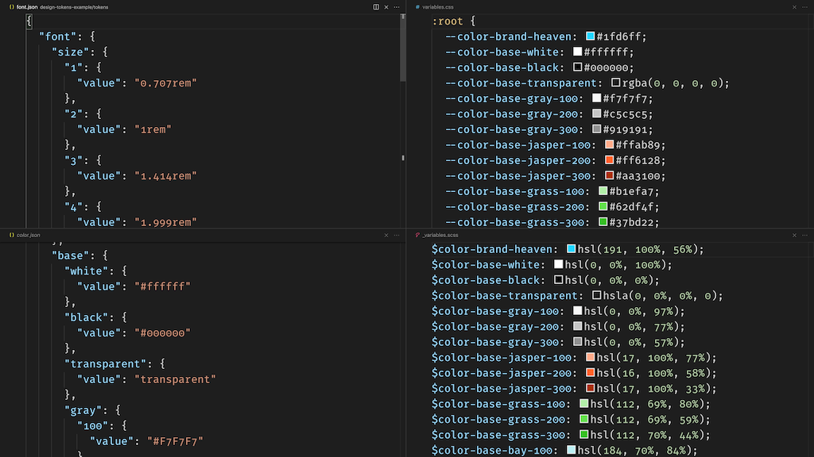

# README



This repository is used as an example for the article [Od design tokenów do zmiennych, czyli Style Dictionary w akcji](https://www.pgs-soft.com/pl/blog/od-design-tokenow-do-zmiennych-czyli-style-dictionary-w-akcji/) (in *Polish*) published on the [PGS software blog](https://www.pgs-soft.com/blog/).

Tokens are built with [Style Dictionary](https://amzn.github.io/style-dictionary/#/).
The repository is the *source of truth* for the following repositories:

- [design-tokens-frontend-a](https://github.com/ryrych/design-tokens-frontend-a)
- [design-tokens-frontend-b](https://github.com/ryrych/design-tokens-frontend-b)

## How to build tokens

```sh
npm run tokens:build
```

## Repository

*npm* package: https://www.npmjs.com/package/@wryrych/design-tokens-example

## Additional resources

**Design tokens**

- [Infor design – tokeny](https://design.infor.com/product/design-tokens)
- [Sprout – tokeny](https://seeds.sproutsocial.com/resources/tokens/)
- [Backpack - tokeny](https://backpack.github.io/tokens/animation/)

**Books, articles**

[Design systems. A practial guide to creating design languages for digital products](https://shop.smashingmagazine.com/products/design-systems-by-alla-kholmatova), A. Kholmatova.

[Expressive Design Systems](https://abookapart.com/products/expressive-design-systems), Yesenia Perez-Cruz

[Naming Tokens in Design Systems](https://medium.com/eightshapes-llc/naming-tokens-in-design-systems-9e86c7444676) Nathan Curtis
